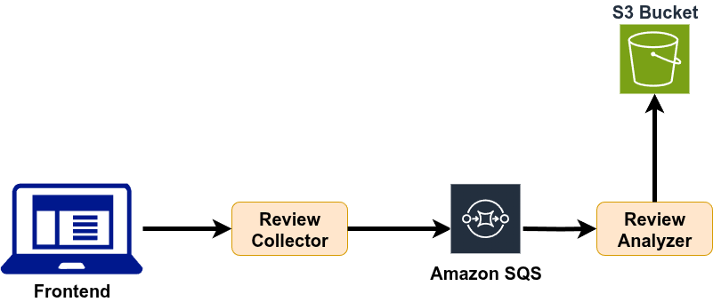
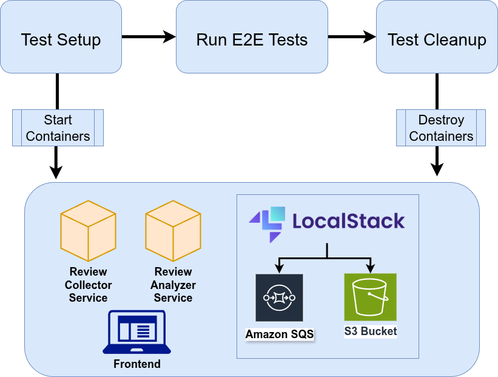

# Terraform Testing in Practice - E2E Testing with Testcontainers and LocalStack

## Table of Contents
- [Microservices](#microservices)
- [Stack](#stack)
- [Requirements to run it locally](#requirements-to-run-it-locally)
- [Instructions to run the project](#instructions-to-run-the-project)
  - [Docker - using Localstack](#1---docker---using-localstack)
  - [Docker - using real AWS services](#2---docker---using-real-aws-services)
  - [Infrastructure as Code with Terraform](#3---infrastructure-as-code-with-terraform)
- [QA Strategy](#qa-strategy)
- [Pipeline Configuration](#pipeline-configuration)
- [Development Info](#development-info)

## Microservices

This repository focuses on the **E2E testing and infrastructure** side of the Review Analysis project: Terraform IaC, Docker Compose orchestration, and Testcontainers/Playwright-driven end-to-end tests. The backend microservices themselves are built and released from a separate repository; here they are only consumed as prebuilt Docker images.

- **Review Collector** (`teixeirafernando/review-collector`) — external image, source maintained in its own repository.
- **Review Analyzer** (`teixeirafernando/review-analyzer`) — external image, source maintained in its own repository.
- **Frontend Review** (React + Vite, built in [frontend-review/](frontend-review)): the web interface for submitting product reviews, and the home of this repo's Playwright E2E test suite.



## Stack

- **Terraform** (Infrastructure as Code for AWS)
- **Test Containers**
- **Localstack**
- **AWS (S3, SQS)**
- **React** (Frontend)
- **Vite** (Frontend tooling)
- **Nginx** (Frontend container)
- **Playwright** (E2E testing)

## Requirements to run it locally

- **Docker**
- **Node**
- **Terraform** (optional, for Infrastructure as Code setup)
- **An AWS account** (if you want to run it using real services; you can use LocalStack which does not require an AWS Account)


## Instructions to run the project


There are different options to run the project. The frontend module is included and can be run together with the backend services using Docker Compose.

#### 1 - Docker - using Localstack


You can simply run this docker-compose command to run the backend services, the frontend module, and Localstack:

```Shell
docker compose up
```

The frontend will be available at [http://localhost:3000](http://localhost:3000).

#### 2 - Docker - using real AWS services

For this option, you need to have a created AWS account and set 2 environment variables, AWS_ACCESSKEY and AWS_SECRETKEY. Depending on your machine OS, you will have a different command to set those environment variables. If you using linux, you can simply run the following:

```Shell
export AWS_ACCESSKEY=YOUR_ACCESSKEY_HERE
```

```Shell
export AWS_SECRETKEY=YOUR_SECRETKEY_HERE
```


Now, we can run this single docker command to run the backend services and the frontend module using real AWS services from your account.

```Shell
docker compose -f docker-compose-real-AWS-services.yml up
```

The frontend will be available at [http://localhost:3000](http://localhost:3000).

#### 3 - Infrastructure as Code with Terraform

This project includes Terraform configuration to manage AWS resources (S3 bucket and SQS queue) as Infrastructure as Code. Terraform supports both LocalStack (development) and real AWS (production).

**Prerequisites:** [Install Terraform](https://learn.hashicorp.com/tutorials/terraform/install-cli)

**Quick Start with LocalStack:**

```Shell
# Initialize Terraform (first time only)
cd terraform
terraform init

# Plan and apply with LocalStack configuration
terraform plan -var-file=local.tfvars
terraform apply -var-file=local.tfvars

# Start the services (in another terminal, from project root)
docker compose up
```

**For Production AWS:**

```Shell
export AWS_ACCESS_KEY_ID="your-access-key"
export AWS_SECRET_ACCESS_KEY="your-secret-key"

cd terraform
terraform apply -var-file=prod.tfvars
```

📖 **For comprehensive Terraform documentation**, see [TERRAFORM.md](TERRAFORM.md).

## QA Strategy

* E2E tests: <b>Playwright, Testcontainers, Localstack</b> — the primary quality gate owned by this repository, exercising the full review submission and analysis flow against ephemeral, production-like infrastructure.
* Unit/component tests for the frontend: <b>Jest, Testing Library</b> (`frontend-review`).
* Infrastructure validation: <b>Terraform fmt/validate/plan</b> against LocalStack configuration.
* The backend microservices (`review-collector`, `review-analyzer`) have their own unit/integration test suites and CI pipelines in their own repository; this repo consumes their published images as-is.
* Continuous Integration: This project uses GitHub Actions to run frontend unit/E2E tests and Terraform validation on every pull request to `main`.

## Testcontainers and LocalStack together in action

This project uses Testcontainers JS and LocalStack to create a robust, fully automated E2E testing environment for cloud microservices. The setup in `frontend-review/e2e/tests` orchestrates all required services (backend microservices, frontend, and LocalStack) using Docker Compose, managed programmatically via Testcontainers.

**How it works:**
- Testcontainers JS launches all containers defined in the Docker Compose file, including LocalStack (which emulates AWS services like S3 and SQS).
- Custom wait strategies ensure each service is ready before tests run (e.g., waiting for health endpoints or log messages).
- After startup, Testcontainers executes commands inside the LocalStack container to create required S3 buckets and SQS queues for the tests.
- Playwright E2E tests interact with the running frontend and backend services, verifying the full review submission and analysis flow.
- The entire environment is ephemeral: containers are started before tests and stopped/cleaned up automatically after.

This approach ensures your tests run against a realistic, production-like environment, with AWS dependencies simulated by LocalStack, and all orchestration handled in code for maximum reproducibility and CI/CD compatibility.

**How to run the E2E tests:**

From the frontend-review folder, you can run:

```bash
npm run test:e2e
```

Or, to see all logs during test execution:

```bash
npm run test:e2e:all-logs
```

 

## Pipeline Configuration

This repository's CI/CD is scoped to the frontend/E2E and infrastructure it owns. Below is an overview of the pipelines that run for every pull request to the main branch:

### Pull Request Pipelines

* **frontend-review-pull-request**
  * Builds and runs the unit and e2e tests for the `frontend-review` frontend.
  * Builds the `frontend-review` Docker image.
* **terraform-pull-request**
  * Validates Terraform code formatting and syntax.
  * Runs `terraform plan` with LocalStack configuration to preview infrastructure changes.
  * Uploads the plan artifact for review and audit trails.

The `review-collector` and `review-analyzer` backend services are built, tested, and released from their own repository; this repo only pulls their published Docker images.

## Development info


### Frontend Review Module

The `frontend-review` module is a React application for submitting product reviews. It is containerized with Docker and served via Nginx. You can run it together with the backend services using Docker Compose as described above. For local development, you can also run:

```Shell
cd frontend-review
npm install
npm run dev
```

Then visit [http://localhost:3000](http://localhost:3000).

